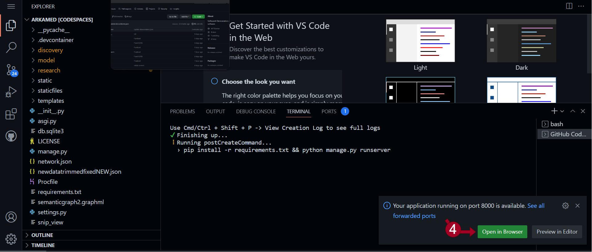

# arkamed
SoftwareX Demosration of discovery software

Due to API retrieval limitations, we have cached the search results retrieved from the Google on 13 Nov 2022.
The software can be explored using one of the following queries: 

{animals in jungle, cricket world cup, football sports, global climate, health advancements, high speed cars, investment and cryptography, latest global affairs, NASA technology, piano instrument}.

Steps to run the code in real time:

1) After loging in to GitHub account open this repo in GitHub CodeSpaces:

2) After opening, wait for few moments and a popup will show in lower right corner, prompting to "open in browser", click it:

Now you are running a complete AMED software, you can browse the results and explore various topics via issuing query mentiond in the start of the instructions.

